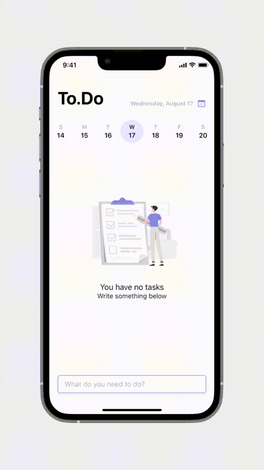

<p align="center"></p>

<div align="center">
<a href="https://github.com/himanshu-matharu/Minimalist-Weather-App/releases">

</a>
<a href="https://github.com/himanshu-matharu/To.Do-App/blob/main/LICENSE">

</a>
</div>

## App Store link
The app is under review on Apple AppStore Connect and will be available soon.

# Description
No unnecessary analysis or grouping. Just a simple todo list.

- Create todo items
- Set important items as high priority
- Todo items are sorted by due date and priority
- Tap the check icon to toggle done status

UI of the app is based on design by <a href="https://www.behance.net/gallery/72614427/To-Do-App-Concept?tracking_source=search_projects%7Cminimal%20todo%20app">Rita Deyneko</a>.

The Figma design file can be found <a href="https://www.figma.com/file/Nx32afmJ52mImzVqvqKbdo/To.Do-iOS-App?node-id=0%3A1">here</a>.

<div>

</div>

# Tech Stack
A brief high-level overview of the tech stack used:
- The app is developed using Swift and the UI is built using the <a href="https://developer.apple.com/documentation/uikit/uistoryboard">Storyboard</a>.
- For persistent storage (database), the app uses <a href="https://developer.apple.com/documentation/coredata">Core Data</a>.

# Installation

1. Clone the repo
```git
git clone https://github.com/himanshu-matharu/To.Do-App.git
```
2. Open the project on XCode.
3. Build and Run.

# License
The To.Do app is free and open-source software licensed under the GNU General Public License v3.0. See the <a href="https://github.com/himanshu-matharu/To.Do-App/blob/main/LICENSE">LICENSE</a> file for more details.

# Contact
For any queries, send me a mail on himanshumatharu1155@gmail.com
